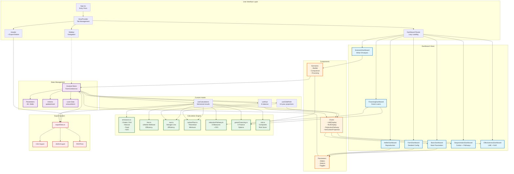
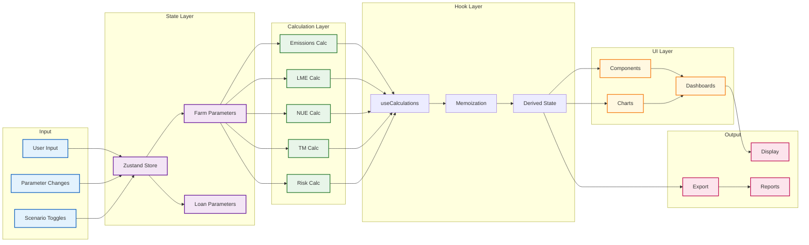
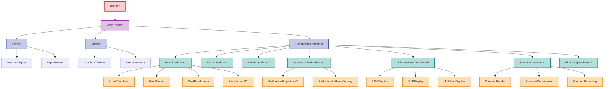
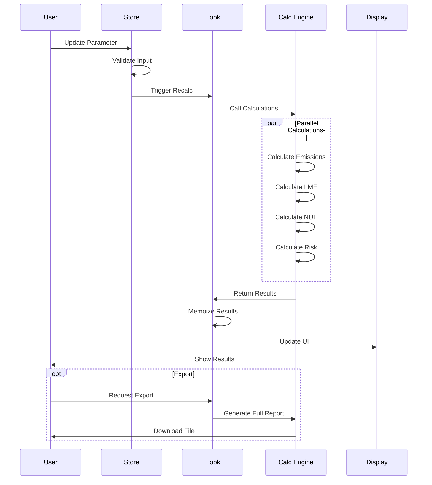
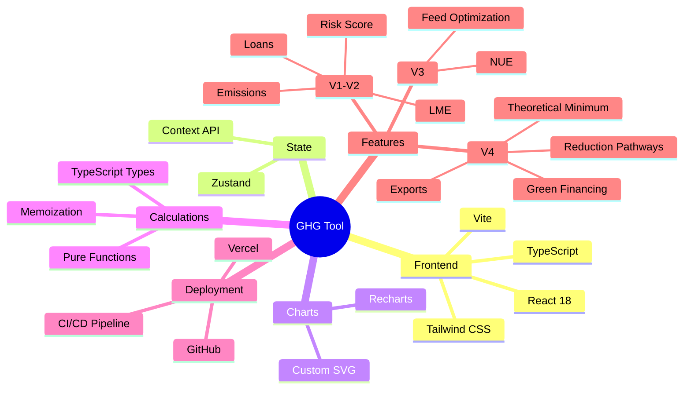

# GHG WHAT-IF Tool Architecture Diagram

## System Architecture Overview

## Data Flow Diagram

## Component Hierarchy

## Calculation Flow

## Technology Stack

---

*These diagrams provide a comprehensive view of the GHG WHAT-IF Tool architecture, data flow, component hierarchy, calculation sequence, and technology stack.*